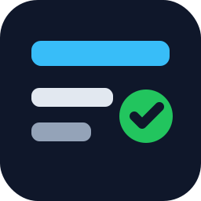

<div align="center">
  
  <h1>GitHub Project Skill</h1>
  <p><strong><code>gh</code> CLI とポータブルな Node helper、日英 docs、GitHub Pages 公開導線をまとめた GitHub Projects 向け Codex skill リポジトリです。</strong></p>
  <p>
    <a href="./README.md">English</a>
    ·
    <a href="https://onizuka-agi-co.github.io/github-project-skill/ja/">Docs</a>
    ·
    <a href="./SKILL.md">Skill Source</a>
    ·
    <a href="./CONTRIBUTING.ja.md">Contributing</a>
  </p>
  <p>
    <a href="https://github.com/onizuka-agi-co/github-project-skill/actions/workflows/repo-qa.yml"></a>
    <a href="https://github.com/onizuka-agi-co/github-project-skill/actions/workflows/docs-qa.yml"></a>
    <a href="https://github.com/onizuka-agi-co/github-project-skill/actions/workflows/deploy-docs.yml"></a>
    <a href="./LICENSE"></a>
    <a href="./SKILL.md"></a>
  </p>
</div>


GitHub Project Skill は、GitHub Projects を Codex から再利用しやすい運用面に変えるためのリポジトリです。実運用向けの `SKILL.md`、`gh project` を薄く包む Node helper、日英ドキュメント、GitHub Pages 公開導線、そして公開リポジトリとして維持しやすい QA 設定までを一式そろえています。

## 🚀 このリポジトリでできること

- GitHub Projects を手作業のボードではなく、運用できる計画面として扱う
- Windows / macOS / Linux で同じフローを保つ
- 繰り返し使う `gh project` 操作を小さな helper に閉じ込める
- docs、CI、Pages、保守ガイドまで含めて公開向けに仕上げる

## ⚡ クイックスタート

1. 前提を確認します。

   - Node.js 20 以上
   - `project` scope を持つ GitHub CLI
   - ローカル skill を読み込める Codex 環境

2. GitHub CLI の認証状態を確認します。

   ```bash
   gh auth status
   gh auth refresh -s project
   ```

3. skill をローカル Codex 環境へリンクします。

   ```bash
   node ./scripts/install_codex_skill_link.mjs
   ```

4. 編集前に project schema を取得します。

   ```bash
   node ./scripts/get_project_schema.mjs \
     --owner onizuka-agi-co \
     --project-number 2 \
     --out ./tmp/project-schema.json
   ```

5. item 一覧をスナップショットとして export します。

   ```bash
   node ./scripts/export_project_items.mjs \
     --owner onizuka-agi-co \
     --project-number 2 \
     --limit 100 \
     --out ./tmp/project-items.json
   ```

6. Codex から skill を呼び出します。

   ```text
   Use $github-project to inspect or update a GitHub Project with gh CLI.
   ```

## 📦 リポジトリ構成

| Surface | 役割 |
| --- | --- |
| [`SKILL.md`](./SKILL.md) | Codex が読む skill 本体と運用ガイド |
| [`agents/openai.yaml`](./agents/openai.yaml) | UI 向けの skill メタデータ |
| [`scripts/`](./scripts) | schema 取得、item export、item 作成、field 更新のための Node helper |
| [`references/`](./references) | コマンド早見表と field ID メモ |
| [`docs/`](./docs) | GitHub Pages で公開する日英 VitePress docs |
| [`CONTRIBUTING.ja.md`](./CONTRIBUTING.ja.md) | ローカル QA と保守フローの案内 |

## 🛠 主な helper

| Script | 役割 |
| --- | --- |
| `scripts/get_project_schema.mjs` | project ID、field、single-select option を見やすい JSON で取得 |
| `scripts/export_project_items.mjs` | project item 一覧を planning や cleanup 用に export |
| `scripts/create_draft_issue.mjs` | project に draft task を追加 |
| `scripts/add_project_item.mjs` | 既存 issue / PR を project に追加 |
| `scripts/set_project_field.mjs` | field 名と option 名で field を更新 |
| `scripts/install_codex_skill_link.mjs` | `CODEX_HOME/skills` 配下へこの repo をリンク |
| `scripts/verify_repo_surfaces.mjs` | README、docs、skill metadata の整合性を確認 |

## 🧭 よく使うフロー

draft issue を作る:

```bash
node ./scripts/create_draft_issue.mjs \
  --owner onizuka-agi-co \
  --project-number 2 \
  --title "Draft task from automation" \
  --body "Track a repeatable planning task"
```

既存 issue / PR を追加する:

```bash
node ./scripts/add_project_item.mjs \
  --owner onizuka-agi-co \
  --project-number 2 \
  --url https://github.com/onizuka-agi-co/github-project-skill/issues/1
```

item を `In progress` に移す:

```bash
node ./scripts/set_project_field.mjs \
  --owner onizuka-agi-co \
  --project-number 2 \
  --item-id PVTI_xxx \
  --field-name Status \
  --option "In progress"
```

## 📚 ドキュメント

- [Docs home](https://onizuka-agi-co.github.io/github-project-skill/ja/)
- [はじめに](https://onizuka-agi-co.github.io/github-project-skill/ja/guide/getting-started)
- [使い方](https://onizuka-agi-co.github.io/github-project-skill/ja/guide/usage)
- [CLI リファレンス](https://onizuka-agi-co.github.io/github-project-skill/ja/guide/cli-reference)
- [アーキテクチャ](https://onizuka-agi-co.github.io/github-project-skill/ja/guide/architecture)
- [トラブルシュート](https://onizuka-agi-co.github.io/github-project-skill/ja/guide/troubleshooting)
- [English docs](https://onizuka-agi-co.github.io/github-project-skill/)

## 🧪 ローカル QA

公開前は次を実行します。

```bash
node --check ./scripts/lib/github-project.mjs
node --check ./scripts/get_project_schema.mjs
node --check ./scripts/export_project_items.mjs
node --check ./scripts/create_draft_issue.mjs
node --check ./scripts/add_project_item.mjs
node --check ./scripts/set_project_field.mjs
node --check ./scripts/install_codex_skill_link.mjs
node --check ./scripts/verify_repo_surfaces.mjs
node ./scripts/verify_repo_surfaces.mjs
cd docs && npm ci && npm run docs:build
```

## 🔎 互換性と公開メモ

- helper script は PowerShell 依存を避けるため Node ベースにしています。
- docs site は `/github-project-skill/` を base path にして GitHub Pages で公開します。
- GitHub Actions では repo QA、docs build QA、Pages deploy、依存更新 automation を扱います。

## 📄 ライセンス

このリポジトリは [MIT License](./LICENSE) で公開しています。
