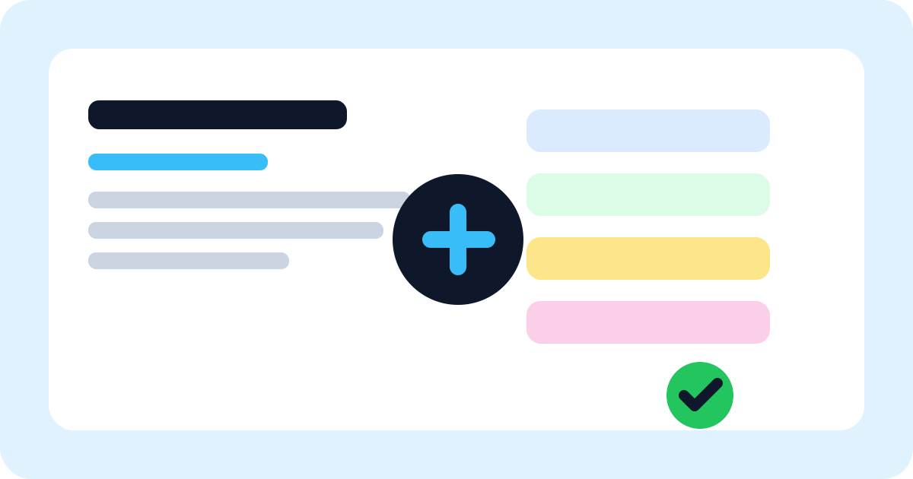

# GitHub Project Skill

[](https://github.com/onizuka-agi-co/github-project-skill/actions/workflows/docs-qa.yml)
[](https://github.com/onizuka-agi-co/github-project-skill/actions/workflows/deploy-docs.yml)
[](./LICENSE)
[](./SKILL.md)

[日本語 README](./README.ja.md) | [Docs](https://onizuka-agi-co.github.io/github-project-skill/) | [Skill Source](./SKILL.md)



GitHub Project Skill is a cross-platform Codex skill for creating, inspecting, and maintaining GitHub Projects with `gh` CLI and portable Node helpers. It gives another Codex instance a clean, repeatable workflow for project setup, field discovery, draft issue creation, item export, and status updates.

## 🚀 Why This Repo

- Turn GitHub Projects into an operational planning surface instead of a manual board.
- Keep the skill portable across Windows, macOS, and Linux.
- Bundle small helper scripts so repeated `gh project` tasks stay reliable and easy to automate.
- Ship the skill with public-facing docs, bilingual onboarding, and GitHub Pages deployment.

## 📦 What Is Included

- [SKILL.md](./SKILL.md): the skill body that Codex consumes after the skill triggers
- [agents/openai.yaml](./agents/openai.yaml): UI metadata for skill lists and chips
- [scripts/](./scripts): Node helpers for `gh project` inspection and updates
- [references/](./references): quick reference files and reusable field-ID notes
- [docs/](./docs): browsable English and Japanese documentation powered by VitePress

## ⚡ Quick Start

1. Clone the repository.
2. Verify GitHub CLI auth:

   ```bash
   gh auth status
   ```

3. Install the skill link into your local Codex home:

   ```bash
   node ./scripts/install_codex_skill_link.mjs
   ```

4. Inspect a project schema:

   ```bash
   node ./scripts/get_project_schema.mjs --owner onizuka-agi-co --project-number 2
   ```

5. Export project items:

   ```bash
   node ./scripts/export_project_items.mjs --owner onizuka-agi-co --project-number 2 --limit 100
   ```

## 🛠 Core Helpers

| Script | Purpose |
| --- | --- |
| `scripts/get_project_schema.mjs` | Resolve project ID, fields, and single-select options |
| `scripts/export_project_items.mjs` | Export project items as JSON for planning or cleanup |
| `scripts/create_draft_issue.mjs` | Create a draft task directly in a project |
| `scripts/add_project_item.mjs` | Add an existing issue or PR to a project |
| `scripts/set_project_field.mjs` | Update a field by readable field and option names |
| `scripts/install_codex_skill_link.mjs` | Create a local skill symlink or junction under `CODEX_HOME` |

## 🧭 Example Commands

Create a draft issue:

```bash
node ./scripts/create_draft_issue.mjs \
  --owner onizuka-agi-co \
  --project-number 2 \
  --title "Draft task from automation" \
  --body "Track a repeatable planning task"
```

Move an item to `In progress`:

```bash
node ./scripts/set_project_field.mjs \
  --owner onizuka-agi-co \
  --project-number 2 \
  --item-id PVTI_xxx \
  --field-name Status \
  --option "In progress"
```

## 📚 Documentation

- [Getting Started](./docs/guide/getting-started.md)
- [Usage](./docs/guide/usage.md)
- [Architecture](./docs/guide/architecture.md)
- [Troubleshooting](./docs/guide/troubleshooting.md)
- [Japanese docs](./docs/ja/index.md)

## 🔎 Repository QA Notes

- The helper scripts are intentionally Node-based so the repo does not assume PowerShell.
- The docs site uses the repository-specific base path `/github-project-skill/`.
- GitHub Pages deployment is wired through Actions so the repo is ready for publishing.

## 📄 License

This repository is released under the [MIT License](./LICENSE).
